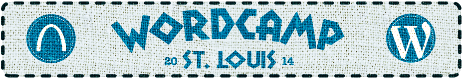

# Master To-Do's 
- Get Venue ✓
- Set Time ✓
- Get Sponsors
- Set Budget - 75% complete 
- Get Speakers 

##Venue
- [Lab Sciencs Building](http://wustl.edu/community/visitors/tour/danforth/laboratory-sciences-building.html)

- Auditorium, 3 classrooms, and common area reserved

##Budget
- donations from [Multi-Event Sponsorship Packages](http://central.wordcamp.org/multi-event-sponsorship-packages)
- Ticket Sales based on 250 person attendance

##Attendance
- Last year we had 250ish planning for this as ticket sale limit

##Timing
- March 1st, 2014

##Automatticians
- [Ryan Markel](http://twitter.com/@ryanmarkel) (From St. Louis)
- [Daryl Koopersmith](http://twitter.com/@koop) (former Automattician, WUSTL alum)*

##Speakers
For a one day event 15 speakers for 3 tracks is recommended in addition to 2 all attendee sessions ( opening, closing )

- [Mary Baum](http://twitter.com/@marybaum)
- [Josh Ray](http://twitter.com/@pdxOllo)
- [Matt Keehner](http://twitter.com/@matthewkeehner)
- [Eric Juden](http://twitter.com/@ericjuden)
- Nashville Guys (Randy, Kenneth, [Nathaniel](http://twitter.com/@nathanielks), [Alex](http://twitter.com/@patin__))
- goBRANDgo (Brandon, Brian)
- [Chip Bennett](http://twitter.com/@chip_bennet)*
- [Pippin Williamson](http://twitter.com/@pippinsplugins)*
- [Carlos Casarez](http://twitter.com/@heckyesitis)*
- Asynchrony Solutions (Possibly Kelly White or Paul Hawke.)
- [Myke Bates](https://twitter.com/MykeBates)

*I've contacted these people about speaking - [Aaron](http://twitter.com/coderaaron)

##Details
- 1 Day Event
- $20 Ticket

##Volunteers
- Matthew Ellsworth
- Matt Keehner
- Josh Ray
- Mary Baum
- Amanda
- Myke Bates ( speaker relations )

##Cameras
- Get Cameras from Automattic
- AV consulting [Chris Miller](https://twitter.com/idonotes)

##Sponsors
###Last Years
- Maryville University (Contact: Eric Juden)
- IPVenger
- Code Poet
- WP Go Host
- Red8 Interactive (Contact: Josh Ray)
- Marketicity
- StopTheHacker
- StickerGiant
- RBO Print Logistix

###Possible
- goBRANDgo
- Integrity
- MasterCard's Incubator projects - Simplify.com

##Promotion
- <http://2014.stlouis.wordcamp.org/> - needs style from anda creative added
- Social Media contact [Nile Flores](https://twitter.com/blondishnet)
- <https://twitter.com/wordcampstl>
- <https://www.facebook.com/WordCampSTL>

##Tracks

- Development ( Themes, Plugins)
- Design / UX 
- Business / Users

