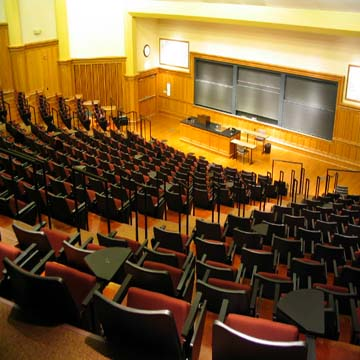
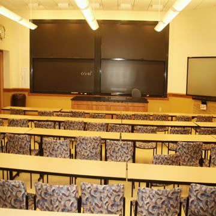

#Can We Pull off a WordCamp?
- Get Venue ✓
- Set Time ✓
- Get Sponsors
- Set Budget
- Get Speakers
- Set Tracks

##Venue
- Wash U. - Just needs to know space requiremnt
- [Lab Sciencs Building](http://wustl.edu/community/visitors/tour/danforth/laboratory-sciences-building.html)
- Auditorium, 3 classrooms, and common area reserved
-
-

##Budget
- $1500 donation from WordPress Foundation

##Attendance
- Last year we had 250ish

##Timing
- March 1st, 2014

##Logo
- Contact: Anda Creative

##Automatticians
- [Ryan Markel](http://twitter.com/@ryanmarkel) (From St. Louis)
- [Daryl Koopersmith](http://twitter.com/@koop) (former Automattician, WUSTL alum)*

##Speakers
- Mary Baum
- [Josh Ray](http://twitter.com/@pdxOllo)
- [Matt Keehner](http://twitter.com/@matthewkeehner)
- [Eric Juden](http://twitter.com/@ericjuden)
- Nashville Guys (Randy, Kenneth, [Nathaniel](http://twitter.com/@nathanielks), [Alex](http://twitter.com/@patin__))
- goBRANDgo (Brandon, Brian)
- [Chip Bennett](http://twitter.com/@chip_bennet)*
- [Pippin Williamson](http://twitter.com/@pippinsplugins)*
- [Carlos Casarez](http://twitter.com/@heckyesitis)*
- Asynchrony Solutions (Possibly Kelly White or Paul Hawke.)

*I've contacted these people about speaking - [Aaron](http://twitter.com/coderaaron)

##Details
- 1 Day Event
- $20 Ticket?

##Volunteers
- Matthew Ellsworth
- Matt Keehner
- Josh Ray
- Mary Baum
- Amanda

##Cameras
- Get Cameras from Automattic

##Sponsors
###Last Years
- Maryville University (Contact: Eric Juden)
- IPVenger
- Code Poet
- WP Go Host
- Red8 Interactive (Contact: Josh Ray)
- Marketicity
- StopTheHacker
- StickerGiant
- RBO Print Logistix

###Possible
- goBRANDgo
- Integrity
- MasterCard's Incubator projects - Simplify.com

##Promotion
- 

##Track Idea
- Build a Plugin Start to Finish
- Hackathon / Code Jam
- Business Track/Topic

##Others
- SLCEC: St. Louis County Economic Councel